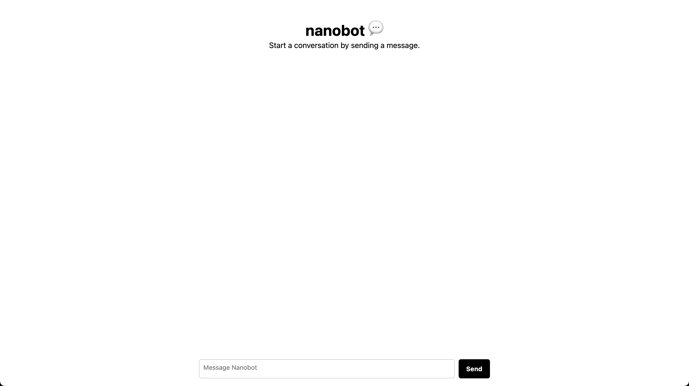

# nanobot

[nanobot](https://nanobot.rdsx.dev) is a simple chat interface built on top off chrome's new ai feature



chrome has recently added a new ai feature, where it can run a local llm model (gemini nano).

```js
const textSession = await window.ai.createTextSession();
const response = await textSession.prompt("Hi there!");
console.log(response);
```

## browser compatibility

Please make sure you are using `Chrome (Dev / Canary) version 127 or higher`

Once your browser is installed, ensure the following flags are set:

1. `chrome://flags/#prompt-api-for-gemini-nano` - Select `Enabled`
2. `chrome://flags/#optimization-guide-on-device-model` - Select `Enabled BypassPrefRequirement`
3. `chrome://components` - Click `Check for Update` on Optimization Guide On Device Model to download the model. If you don't see Optimization Guide, ensure you have set the flags correctly above, relaunch your browser, and refresh the page.

demo: [nanobot.rdsx.dev](https://nanobot.rdsx.dev)
